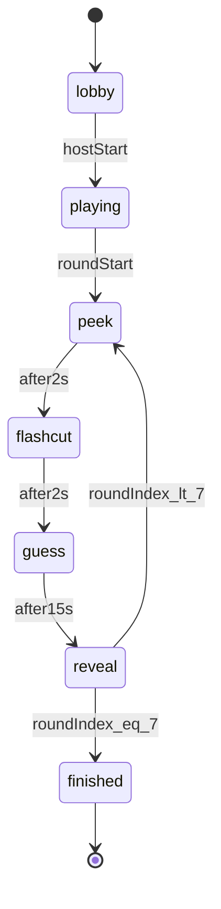
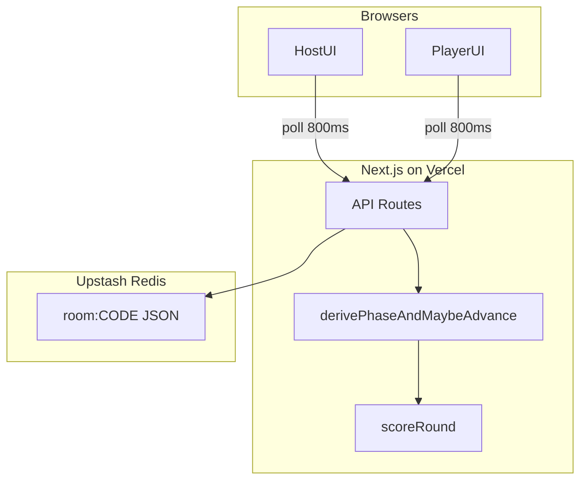

# FLASHCUT — build spec

**Status:** Spec complete — ready for Phase B implementation  
**Tagline:** *See it. Gone. Guess it.*

Private team party game: brief image peek → blackout → memory guess (MCQ). **8 fixed rounds**, FFA scoring, **one winner** by highest total. Deploy on **Vercel** with **Upstash Redis**.

**Requirements source:** [game-ideas.md](../../game-ideas.md)  
**Starter content:** [content-pack-starter-01.json](content-pack-starter-01.json)

---

## 1. Product summary

FLASHCUT is a browser game for ~20 remote coworkers (Philippines, Australia, offshore). Each round shows a universal image (zoomed, blurred, or silhouetted) for **2 seconds**, then a **2-second blackout**, then **15 seconds** to pick one of four answers. After **8 rounds** (~10 minutes), the player with the **most points** wins.

**Traceability to requirements:**

| Req | How FLASHCUT satisfies it |
| --- | ------------------------- |
| Team-only, not global | Optional `ROOM_PASSWORD`, `robots.txt` disallow, no accounts |
| ~20 players, FFA | Up to 25 players; individual scores every round |
| One winner | Highest session point total + tiebreaker |
| ~10 min | 8 rounds × ~24 s active + lobby/podium |
| Web / React | Next.js App Router |
| Universal content | Curated image packs; MCQ only |
| Remote fair | Server timers; 15 s guess window; no elimination |
| Original hook | Blackout memory beat (not slow zoom reveal) |

### Out of scope (v1)

- User accounts, login, seasons, global leaderboards  
- Elimination / last-player-standing mode  
- Second game mode (e.g. word grid)  
- Coworker photo uploads  
- Free-text answers  
- Public SEO / marketing site  
- WebSockets (use Redis + polling on Vercel)  
- Image upload UI  

---

## 2. Game loop and state machine

### Session shape

| Block | Duration |
| ----- | -------- |
| Lobby (join) | ~1 min |
| 8 rounds | ~8 min |
| Results podium | ~30 s |

### Round phases

| Phase | Duration | Server `phase` | Player sees |
| ----- | -------- | -------------- | ----------- |
| Peek | 2 s | `peek` | Image with mode effect (zoom / blur / silhouette) |
| Flashcut | 2 s | `flashcut` | Black screen + “What was it?” |
| Guess | 15 s | `guess` | 4 large MCQ buttons (image hidden) |
| Reveal | 5 s | `reveal` | Full image, correct answer, round points, top 5 |

**Total per round:** 24 s. **8 rounds:** 192 s (~3.2 min) active phase time; with polling/reveal UX ≈ 8 min gameplay.

### State machine



Phase transitions are **server-authoritative**. Clients derive display from `GET /api/rooms/[code]` response; they do not run local timers to advance the game.

On every read, the server:

1. Loads room from Redis  
2. Computes current `phase` from `phaseStartedAt` and fixed durations  
3. If reveal elapsed, atomically advances `roundIndex` (or sets `status: finished`)  
4. Returns sanitized payload for the computed phase  

### Answer rules

- One answer per player per round  
- Player may **change** choice until guess phase ends (last write wins)  
- `lockedAt` timestamp set on each `POST /answer`; used for early-lock bonus  
- No answer before guess phase → **0** for that round  
- Correct answer and choices **never** sent during `peek` or `flashcut`  

---

## 3. TypeScript types (canonical)

Spec types — implement in `lib/types.ts` during Phase B.

```ts
type RoomStatus = "lobby" | "playing" | "finished";
type Phase = "peek" | "flashcut" | "guess" | "reveal";
type ImageMode = "zoom" | "silhouette" | "blur";

interface Crop {
  /** 0–1, horizontal origin of zoom focus */
  x: number;
  /** 0–1, vertical origin of zoom focus */
  y: number;
  /** scale factor applied on peek (e.g. 8–12) */
  scale: number;
}

interface RoundDefinition {
  id: string;
  mode: ImageMode;
  imageUrl: string;
  crop?: Crop; // required when mode === "zoom"
  choices: [string, string, string, string];
  answer: string; // must equal one of choices
  category: "objects" | "animals" | "food" | "world";
}

interface Pack {
  id: string;
  name: string;
  rounds: RoundDefinition[]; // exactly 8 for starter
}

interface Player {
  id: string;
  nickname: string;
  totalScore: number;
  roundsCorrect: number;
  joinedAt: number;
}

interface PlayerAnswer {
  choice: string;
  lockedAt: number; // ms epoch
}

interface RoundResult {
  roundIndex: number;
  scores: Record<string, number>; // playerId → points earned this round
}

interface Room {
  code: string;
  hostId: string;
  hostToken: string;
  status: RoomStatus;
  packId: string;
  roundIndex: number; // 0–7 during playing
  phase: Phase;
  phaseStartedAt: number; // ms epoch
  players: Record<string, Player>;
  answers: Record<string, PlayerAnswer>; // playerId → current round answer
  roundResults: RoundResult[];
  createdAt: number;
  maxPlayers: number; // default 25
}

/** Public GET response — fields vary by phase */
interface RoomPublicState {
  code: string;
  status: RoomStatus;
  roundIndex: number;
  roundCount: 8;
  phase: Phase;
  phaseEndsAt: number;
  players: Array<{ id: string; nickname: string; totalScore: number }>;
  standings: Array<{ id: string; nickname: string; totalScore: number }>; // top 5

  // peek | flashcut | guess | reveal
  imageUrl?: string;
  imageMode?: ImageMode;
  crop?: Crop;

  // guess | reveal only
  choices?: [string, string, string, string];

  // reveal only
  answer?: string;
  roundScores?: Record<string, number>;
  yourAnswer?: string;
  yourRoundScore?: number;
}
```

### Phase timing constants

```ts
const PHASE_MS = {
  peek: 2000,
  flashcut: 2000,
  guess: 15000,
  reveal: 5000,
} as const;

const ROUND_COUNT = 8;
const EARLY_LOCK_WINDOW_MS = 4000; // first 4s of guess phase
const BASE_POINTS = 500;
const EARLY_LOCK_BONUS = 300;
```

---

## 4. Scoring and tiebreaker

### Per round

```ts
function scoreRound(
  choice: string,
  answer: string,
  lockedAt: number,
  guessPhaseStartedAt: number
): number {
  if (choice !== answer) return 0;
  const elapsed = lockedAt - guessPhaseStartedAt;
  const earlyBonus =
    elapsed <= EARLY_LOCK_WINDOW_MS ? EARLY_LOCK_BONUS : 0;
  return BASE_POINTS + earlyBonus;
}
```

- Multiple players may score on the same round  
- Wrong answer: **0** (no negative points in v1)  

### Session winner

1. Highest `totalScore` after round 8 reveal completes  
2. Tiebreaker: most `roundsCorrect`  
3. Then highest single-round score in the session  
4. Then earliest `lockedAt` among correct answers on round 8 (lowest timestamp wins)  

### Leaderboard

- Between rounds (during `reveal`): show **top 5** by `totalScore`  
- Results page: full standings sorted by rank  

---

## 5. Content pack schema

### Pack file location

- **Dev / build:** `content/packs/starter-01.json`  
- **Runtime:** import or read at room create; image assets in `public/packs/`  
- **Spec example:** [content-pack-starter-01.json](content-pack-starter-01.json)  

### Round mix (starter-01)

| Rounds | Category | Modes |
| ------ | -------- | ----- |
| 1–2 | objects | zoom |
| 3–4 | animals | silhouette |
| 5–6 | food | blur |
| 7–8 | world | zoom |

### Validation rules

- `choices` length exactly 4  
- `answer` must match one choice (case-sensitive trim)  
- `imageUrl` must start with `/packs/`  
- `crop` required when `mode === "zoom"`  
- No duplicate `id` within pack  

### Image sourcing (Phase D)

- Use Unsplash, Pexels, or Wikimedia Commons (check license)  
- Prefer concrete nouns recognizable in Manila and Sydney  
- Avoid brands, logos, celebrities, regional slang  
- Target size: ~1200×800 JPEG/WebP, &lt; 200 KB each  

### Placeholder strategy (Phase B–C)

- Use solid-color placeholder images in `public/packs/placeholders/` until real assets exist  
- Pack JSON references placeholders; swap paths when curated  

---

## 6. API contract

Base URL: `https://<your-vercel-project>.vercel.app` (private team deployment).

### Auth tokens

- **hostToken:** returned on `POST /api/rooms`; required for host actions (`start`, `skip`, `end`)  
- **playerToken:** returned on join; required for `POST /answer`  
- Pass as header: `Authorization: Bearer <token>`  
- Store in `localStorage` keyed by room code  

### Endpoints

| Method | Route | Auth | Purpose |
| ------ | ----- | ---- | ------- |
| `POST` | `/api/rooms` | — | Create room |
| `POST` | `/api/rooms/[code]/join` | — | Join lobby |
| `GET` | `/api/rooms/[code]` | optional token | Poll room state; advances phases |
| `POST` | `/api/rooms/[code]/start` | host | Lobby → playing, round 0 peek |
| `POST` | `/api/rooms/[code]/answer` | player | Submit/update choice during guess |
| `POST` | `/api/rooms/[code]/skip` | host | Force advance to next phase/round |
| `POST` | `/api/rooms/[code]/end` | host | End session → finished |

### `POST /api/rooms`

**Request:**

```json
{
  "packId": "starter-01",
  "password": "optional-if-not-using-env"
}
```

**Response `201`:**

```json
{
  "code": "ABC123",
  "hostToken": "uuid",
  "hostUrl": "/room/ABC123/host",
  "joinUrl": "/join/ABC123"
}
```

- Generate 6-char code from `A–Z0–9` (exclude ambiguous `0/O`, `1/I` optional)  
- If `ROOM_PASSWORD` env is set, require matching `password` on join (not on create)  

### `POST /api/rooms/[code]/join`

**Request:**

```json
{
  "nickname": "Alex",
  "password": "team-secret"
}
```

**Response `200`:**

```json
{
  "playerId": "uuid",
  "playerToken": "uuid",
  "nickname": "Alex"
}
```

**Errors:** `403` wrong password; `409` room full or already playing; `404` unknown code  

**Nickname:** trim, 2–20 chars; duplicate → append `-2`, `-3`, …  

### `GET /api/rooms/[code]`

Called by clients on interval (see polling). Server may mutate room (phase advance) before respond.

**Response shaping by phase:**

| Phase | Include | Omit |
| ----- | ------- | ---- |
| `peek` | `imageUrl`, `imageMode`, `crop` | `choices`, `answer` |
| `flashcut` | — (black UI client-side) | image, choices, answer |
| `guess` | `choices` | `answer`, image |
| `reveal` | full image, `answer`, `roundScores`, standings | — |

Include `phaseEndsAt` (computed) on every response during `playing`.

**Polling intervals (client):**

- Lobby: every **3000 ms**  
- Playing: every **800 ms**  

### `POST /api/rooms/[code]/start`

Host only. `status` must be `lobby`. Sets `status: playing`, `roundIndex: 0`, `phase: peek`, `phaseStartedAt: now`, clears `answers`.

### `POST /api/rooms/[code]/answer`

**Request:**

```json
{ "choice": "Headphones" }
```

Only during `guess` phase. `choice` must be one of the round’s four options.

### `POST /api/rooms/[code]/skip`

Host only. Advances to next phase boundary or next round (useful if stuck). Scores current round if leaving `guess` → `reveal`.

### `POST /api/rooms/[code]/end`

Host only. Sets `status: finished`, computes final standings.

### Error format

```json
{ "error": "Human message", "code": "ROOM_NOT_FOUND" }
```

---

## 7. Architecture



### Redis

- Key: `room:{code}` — JSON serialized `Room`  
- TTL: **2 hours** from create; refresh on activity optional  
- Updates: use optimistic locking or Upstash Redis `WATCH`/`MULTI` pattern to avoid double phase advance when many clients poll  

### Suggested module layout (Phase B)

```
team-games/flashcut/
  app/
    page.tsx                    # home: create / join
    join/[code]/page.tsx
    room/[code]/page.tsx        # player
    room/[code]/host/page.tsx
    room/[code]/results/page.tsx
    api/rooms/...
  lib/
    types.ts
    redis.ts
    room-store.ts
    phase-engine.ts
    scoring.ts
    packs.ts
  content/packs/starter-01.json
  public/packs/...
```

---

## 8. UI screens and routes

| Route | Role | Key UI |
| ----- | ---- | ------ |
| `/` | Anyone | “Create game” / “Join with code” |
| `/join/[code]` | Player | Nickname input, password if needed, player list |
| `/room/[code]` | Player | Phase view, score, MCQ buttons in guess |
| `/room/[code]/host` | Host | Player list, round `3/8`, Start / Skip / End |
| `/room/[code]/results` | All | Winner, podium top 3, full table |

### Player UX notes

- Mobile-first: large tap targets (min 48px)  
- Guess phase: four full-width buttons  
- Flashcut: full viewport black + white text  
- Show personal `totalScore` and `round X of 8` always during play  
- Optional: subtle countdown bar from `phaseEndsAt`  

### Image rendering (client)

| Mode | CSS |
| ---- | --- |
| `zoom` | `transform: scale(scale)`; `transform-origin: ${x*100}% ${y*100}%` |
| `silhouette` | `filter: brightness(0) contrast(1.2)` |
| `blur` | `filter: blur(24px)` |

During `reveal`, show full image without effects.

---

## 9. Edge cases

| Case | Behavior |
| ---- | -------- |
| Reconnect | `localStorage` holds `playerToken`; resume polling same room |
| Rejoin same nickname in lobby | Allow reclaim if token matches |
| Late join | Only while `status === lobby` |
| Max players | 25; reject with `409` |
| Duplicate nicknames | Auto-suffix `-2`, `-3` |
| Room not found | `404` |
| Game finished | `GET` returns standings; redirect to `/results` |
| Host disconnect | Game continues; no host transfer in v1 |
| AFK (no answer) | 0 points that round |
| Skip mid-round | Host forces phase advance |

---

## 10. Environment and deploy

### Environment variables

```bash
UPSTASH_REDIS_REST_URL=
UPSTASH_REDIS_REST_TOKEN=
ROOM_PASSWORD=          # optional shared team secret
```

### Vercel

1. Import `team-games/flashcut` as project root (or monorepo subfolder).  
2. Add Upstash Redis integration (or manual env vars).  
3. Deploy; share preview/production URL with team only.  

### `public/robots.txt`

```
User-agent: *
Disallow: /
```

### Pre-game checklist

- [ ] Env vars set on Vercel  
- [ ] `starter-01` pack loads; 8 images resolve  
- [ ] Create → join (2 tabs) → start → complete 8 rounds  
- [ ] `ROOM_PASSWORD` tested if used  

### Cost

Vercel Hobby + Upstash free tier: sufficient for monthly ~20-player sessions.

---

## 11. Implementation phases

| Phase | Scope | Status |
| ----- | ----- | ------ |
| **A** | Docs + starter pack JSON | Done |
| **B** | Redis room store, phase engine, scoring, Vitest | Done |
| **C** | Next.js UI + API routes + polling | Done |
| **D** | Curate 8 real images | Not started |
| **E** | 20-player playtest, timer tuning | Not started |

**Implementation order:** Redis module → API routes → player UI → host UI → content → deploy.

---

## 12. Verification

### Unit tests (Vitest)

- `derivePhase(room, now)` for all phase boundaries  
- `scoreRound` — correct, wrong, early-lock bonus boundary at 4s  
- `pickWinner` — tiebreaker chain  
- Pack validation — reject bad `answer` / missing `crop`  

### Manual smoke

1. `POST /api/rooms` → code  
2. Two `join` → `start`  
3. Play through 8 rounds via polling  
4. Verify winner on results  

### Lint / types

- `npm run lint`  
- `npm run typecheck`  

---

## 13. Locked decisions (formerly open questions)

| Question | Decision |
| -------- | -------- |
| Round count | **8** |
| Peek duration | **2 s** |
| Early-lock bonus | **+300** within first **4 s** of guess |
| Deploy | **Private Vercel** + Upstash Redis |
| Realtime | **Polling 800 ms** (no WebSockets v1) |

---

## Related

- [README.md](../README.md)  
- [game-ideas.md](../../game-ideas.md)  
- [content-pack-starter-01.json](content-pack-starter-01.json)
